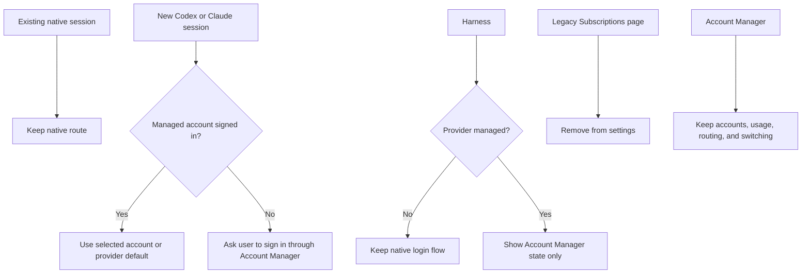

# Remove the legacy Subscriptions settings page

## Purpose

Remove the old native Codex account-management page labelled **Subscriptions**
after the managed-provider backward-compatibility change is committed.

The new Account Manager becomes the only account-management UI for Codex and
Claude. Older native sessions must continue to work, so the internal native
launch and resume support stays until those sessions naturally disappear.

## Correct feature boundary

The visible legacy page comes from the Codex account-management work in:

- commit `c02317774`: `feat(codex): add accounts and global switching (#4722)`;
- commit `55781a5db`: `feat(settings): rename agents section to subscriptions`.

The page is the frontend `CodexAccountsSection` and its native account rows,
capacity cards, device-account reconciliation, native login terminal, and
global device-account switch controls.

The old provider-neutral Plan Usage page from local PR #4218 is not an
ancestor of the current `codex/cliproxy-account-manager` checkout. It must not
be removed or recreated as part of this work.

## Final boundary

### Remove from the user interface

- the `agents` settings entry labelled “Subscriptions”;
- `CodexAccountsSection` and its child account-row/detail/login components;
- frontend hooks used only by that page:
  `useCodexAccountsQuery`, `useCodexAccountActions`, and the native account
  display state helpers;
- native account-management translations and tests that are no longer used;
- generated API paths and types only used by the removed settings page;
- stale settings tests that expect a “Subscriptions” navigation item.

### Keep internally for compatibility

- native Codex credential reading needed by sessions created before Account
  Manager adoption;
- native session resume and launch behavior;
- readiness checks used to diagnose an old native session;
- durable historical account and switch migrations;
- the CLIProxy helper, managed account APIs, and Account Manager UI;
- managed account usage and managed quota auto-switching;
- normal session token/cost usage;
- all unsupported-provider native flows.

The backend native account service may be reduced later, but only after a
separate audit proves that no pre-feature session, resume path, migration, or
CLI command still uses it.

## Backward-compatibility behavior to implement first

Before removing the page:

1. Codex and Claude are always treated as Account Manager providers for **new**
   sessions.
2. Harness checks only the managed account list for these providers.
3. Native login does not make a managed provider appear signed in.
4. A new managed-provider session without a signed-in Account Manager account
   stops with an Account Manager sign-in action instead of falling back to
   native credentials.
5. Sessions created before this change keep their native route, including after
   an AO restart.
6. An old native session may be moved by an explicit user action; it is never
   silently migrated.
7. Providers outside Account Manager keep their current native behavior.

## Implementation sequence

### Phase 1: Make the managed boundary real

#### Backend

- Update `provideraccounts.ResolveAccount` so Codex and Claude require a
  managed account for every new session, even when native credentials exist.
- Preserve the route-less native path only for sessions that already exist.
- Keep explicit managed account selection and provider defaults unchanged.
- Return the existing typed login-required error when no managed account is
  available.
- Add service/session tests for native credentials present + no managed account,
  managed account present, explicit managed selection, and unsupported
  providers.

#### Harness UI

- Read `useProviderAccounts` for Codex and Claude.
- Show connected only when at least one managed account is signed in.
- Show Account Manager sign-in when none is signed in.
- Do not expose native login controls for Codex or Claude.
- Leave native readiness and login controls unchanged for other providers.
- Keep installation status visible for every provider.
- Add frontend tests for native-only, managed-signed-in, managed-signed-out,
  and unsupported-provider cases.

#### New-session UI

- Keep the existing managed-account selector in `TaskComposer`.
- Ensure the no-account option is an actionable Account Manager sign-in state,
  not a native-login fallback.
- Add a focused test that native readiness cannot enable a new Codex or Claude
  session when the managed catalogue is empty.

### Phase 2: Commit the compatibility change

- Regenerate the OpenAPI and frontend API types only if the boundary requires a
  contract change.
- Run focused backend and frontend tests sequentially.
- Commit this phase separately, for example:

```text
feat(auth): require managed accounts for new Codex and Claude sessions
```

### Phase 3: Remove the legacy settings page

1. Remove the `agents` item from `settingsCatalog.tsx`.
2. Remove `CodexAccountsSection` and its page-only child components.
3. Remove page-only frontend hooks and state helpers.
4. Remove page-only translations in every locale.
5. Remove page-only frontend tests and update settings navigation tests.
6. Remove generated API paths only if no remaining caller needs them.
7. Regenerate `frontend/src/renderer/routeTree.gen.ts` and
   `frontend/src/api/schema.ts` when source changes require it.

The Account Manager entry remains and becomes the only Codex/Claude account
surface.

### Phase 4: Audit backend native code before touching it

For every backend file connected to the old page, classify it:

- **keep** if it supports old native session launch/resume;
- **remove** if it exists only to serve the deleted page;
- **split** if it serves both.

Likely page-only HTTP routes include the old Codex account catalogue,
native login-terminal, logout/delete, capacity reset, and native switch
endpoints. Remove those routes only after searching for CLI, migration, and
session-resume callers.

Do not remove `codex_account_service`, readiness hooks, credential readers, or
durable migrations merely because the settings page is gone. Old native
sessions depend on internal compatibility support.

### Phase 5: Storage and generated artifacts

- Never rewrite or delete an already shipped SQLite migration.
- Keep historical Codex account and switch tables so existing installations
  open safely.
- Remove active queries/store methods only when no compatibility path uses them.
- Regenerate sqlc only after changing source queries; never hand-edit generated
  files.
- Regenerate OpenAPI and TypeScript types together after route changes.
- Remove unused native UI dependencies only after the frontend typecheck passes.

### Phase 6: Validation and cleanup

Run checks one at a time:

1. Provider-account service tests.
2. Session spawn and native-resume tests.
3. Harness and Task Composer frontend tests.
4. Settings navigation and Account Manager tests.
5. HTTP/spec drift tests.
6. Migration tests against fresh and upgraded databases.
7. Required repository suites, sequentially.

Search after the change for `CodexAccountsSection`, the old “Subscriptions”
settings id, old native account UI endpoints, and removed translation keys.
Every remaining match must be either an intentional compatibility path or a
historical migration.

## Tests that must remain green

### Compatibility

- Old native Codex session resumes after AO restart.
- New Codex session with only native credentials is blocked with Account Manager
  sign-in guidance.
- New Claude session follows the same managed-only rule.
- New managed sessions use the default or explicit managed account.
- Unsupported providers still use native authentication.

### Account Manager

- Account list, login, logout, remove, and default selection still work.
- Per-session account selection still works.
- Request-based default switching still affects the next managed request.
- Automatic quota switching still changes the managed default.
- Managed usage remains visible in Account Manager.
- Removing the last managed account still produces the expected sign-in state.

### UI removal

- Settings no longer contains the old “Subscriptions” page.
- Account Manager remains visible and reachable.
- Harness shows Account Manager sign-in for managed providers with no account.
- No native Codex account panel is rendered.
- Unsupported-provider native controls remain available.

## Commit shape

The final history should look like:

```text
feat(auth): require managed accounts for new Codex and Claude sessions
refactor(settings): remove legacy native subscriptions page
```

The second commit must not delete the compatibility backend or change managed
account routing.

## Acceptance criteria

- New Codex and Claude sessions never silently use native credentials.
- Existing native sessions continue to work after restart.
- Harness reports only Account Manager state for Codex and Claude.
- Account Manager is the only account-management UI for those providers.
- Managed usage and automatic switching still work.
- Fresh and upgraded databases open successfully.
- Generated contracts are current.
- The two commits can be reviewed and reverted independently.



