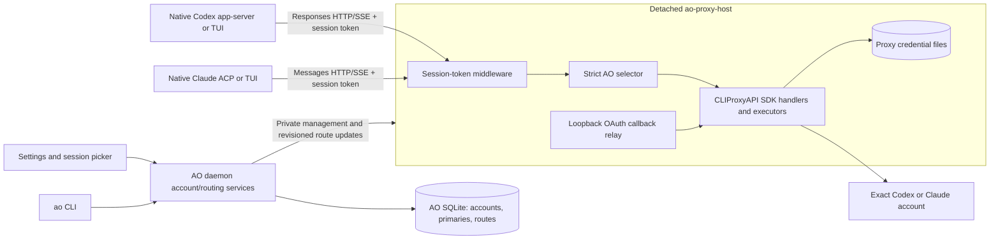
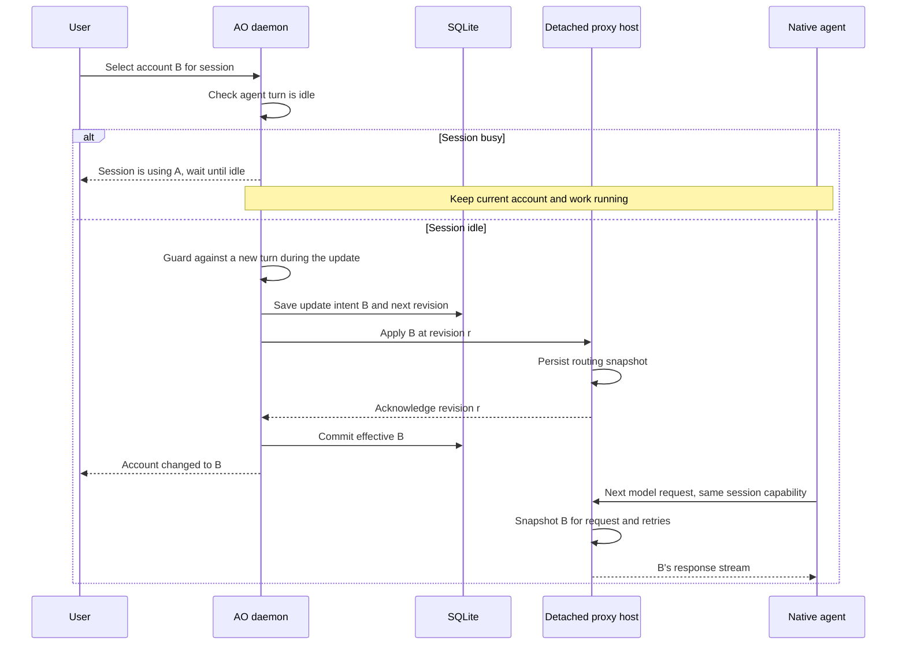

# Approach 1: one detached helper using the Go SDK

**Recommended.** Run one AO-owned `ao-proxy-host` process containing CLIProxyAPI's public v8 SDK, with a small AO selector and a private management adapter. Put its dependency in a separate Go module so the broad upstream dependency graph stays out of AO's backend module. Merely adding `backend/cmd/ao-proxy-host` to the existing module would not achieve that isolation.

This gives all Codex/Claude accounts one refresh/storage owner and one inference endpoint. It requires no upstream fork and no reimplementation of Responses, Anthropic Messages or SSE handlers.

## Components and ownership



The daemon owns user policy and durable account/session IDs. The host owns the live proxy runtime, provider credentials, refresh and an acknowledged routing snapshot. The UI receives account identity/availability and acknowledged selections, never provider tokens. A stable session capability identifies the route; changing accounts changes the host mapping rather than the native process environment. Durable update intents below recover interrupted operations; they are not a background queue for user actions attempted while sessions are busy.

Use one SDK service per process. Upstream token/model registries and OAuth state include process-global storage. A separate process also contains dependency failures and OAuth worker lifetimes. The host persists/reconciles route snapshots under the AO data directory, with SQLite remaining the policy authority.

## Exact request routing without a fork

The SDK exposes a public `coreauth.Selector` and `sdk/api.WithRouterConfigurator`. The configurator receives a `BaseAPIHandler` with its exported auth manager. Install the selector there, during server construction before the listener starts.

Conceptual installation, using the current exports:

```go
// Sketch: session middleware/selector implementations are AO glue.
svc, err := cliproxy.NewBuilder().
    WithConfig(cfg).
    WithConfigPath(privateConfigPath).
    WithServerOptions(
        proxyapi.WithMiddleware(sessionRoutingMiddleware),
        proxyapi.WithRouterConfigurator(func(
            _ *gin.Engine, base *handlers.BaseAPIHandler, _ *config.Config,
        ) {
            base.AuthManager.SetSelector(strictSessionSelector)
        }),
    ).Build()
```

`cliproxy`, `proxyapi`, `handlers` and `config` refer to public `/v8/sdk/cliproxy`, `/v8/sdk/api`, `/v8/sdk/api/handlers` and `/v8/sdk/config` packages. The sketch omits lifecycle and error handling; it is not proposed production code.

Request mechanics:

1. Middleware validates the opaque session bearer against the host's route snapshot. An unknown capability is rejected before inference.
2. Strip any client-supplied internal routing header. Resolve the account once and stamp an immutable internal auth-ID header. Replace session credentials with the host's internal inference credential if using the SDK's standard API-key middleware.
3. Standard upstream HTTP/SSE handlers copy request headers into executor options. The selector finds only the exact matching auth ID among eligible provider/model candidates. Missing/disabled/cooling-down/incompatible credentials yield an error.
4. Where available, set `executor.PinnedAuthMetadataKey` in the request metadata to reinforce upstream candidate filtering. Reuse the same account snapshot through every retry/bootstrap attempt. Provider/account IDs are resolved server-side; native processes never supply an arbitrary upstream account selection.
5. Return normal upstream protocol errors/streams. Add safe account-specific availability to AO's control/read API.

This selector is necessary because simply attaching `handlers.WithPinnedAuthID` to `c.Request.Context()` does **not** reach ordinary stock handlers: they construct execution context from `context.Background()`. The Gin headers do reach executor options. This is a verified source-level distinction, not a missing OAuth capability. [Header propagation and context evidence](evidence.md#routing-and-sdk).

## Configuration constraints

Let the builder create its **default manager**. Its default path records the normalized initial routing state. Passing `WithCoreAuthManager` leaves that state unset, allowing the initial watcher reload to replace a custom selector.

Keep strategy, session-affinity, affinity TTL and subagent-affinity settings fixed in AO's private proxy configuration. The service replaces its selector when that normalized state changes. Disable Home and dynamic plugins, and keep credential priorities equal. Primary selection lives in AO; upstream priority changes must not hide a selected account from the candidate tier.

Expose only account operations through AO. Arbitrary upstream config writes and a standalone management panel are outside this integration surface. Validate selector installation at startup and in compatibility tests; refuse traffic if the host cannot enforce its route contract. This does not make the SDK API stable across untested upstream versions: pin a version/commit and run routing/reload tests before upgrading.

## Login, list, sign-out and delete

Use upstream management operations for OAuth initiation/completion/status, credential inventory, refresh and local deletion. The helper adds a loopback callback relay instead of invoking the all-interface callback flow. An optional `WithPostAuthHook` tags the newly created auth record with an AO correlation ID before persistence. Hook invocation is not durable login completion: poll OAuth success and verify inventory before marking the account ready. Without a hook, serialize and reconcile inventory.

All native processes receive session-scoped gateway capabilities rather than provider refresh tokens. Persist provider credentials only in the host's dedicated auth directory. Map AO IDs to upstream credential identity separately so reauthentication or filename changes do not erase session pins.

Sign-out removes the local credential while retaining the AO row for reauthentication. Delete removes the AO row after resolving session references. Both move affected routes to the matching primary with a message; removing the primary requires a replacement when other usable accounts remain. With no accounts, preserve managed sessions in a login-required state and restore their routes to the next successfully added primary. Show busy affected sessions and require waiting until they are idle before completing the operation. Neither action is described as revoking the provider's authorization grant. See the common [semantics](README.md#product-semantics-shared-by-both-approaches).

## Switching and survival



Updates are idempotent and revisioned. If the daemon dies after host acknowledgement but before the effective DB commit, reconcile the pending revision on reconnect. During ordinary daemon replacement, the host continues with its acknowledged routes. A cold restart reconstructs policy before accepting inference. Stable addressing and process identity validation should follow AO's detached-host patterns; a failed probe alone is not proof the host is dead.

Start with HTTP/SSE. Existing Responses WebSocket connections keep their own account pin and incremental continuation state. Account changes over a retained socket can conflict with the new route. HTTP/SSE avoids that socket binding, but continuation/compaction still needs live tests across accounts. Account changes apply at idle boundaries, with a tested native conversation reconstruction path when required.

## Expected change size

| Authored production area | Estimated LOC |
| --- | --- |
| Account/default/session facts, removal/recovery service and narrow API | 550–800 |
| Helper, strict selector, session gate and management/OAuth relay | 600–800 |
| Native launch, readiness and route propagation | 350–450 |
| Settings account panel and session pickers | 550–650 |
| Detachment, build/packaging and recovery wiring | 450–600 |
| **Total** | **2,500–3,300** |

This updated forecast includes the finalized idle-only removal and no-account/login recovery rules. Target roughly 3,000 effective production LOC; the forecast is not a measured count or guaranteed cap. Tests/generated files/dependencies are excluded from production LOC. Reuse existing UI and detached-process primitives.

The user's test requirement is interpreted as production:test **1:4 or more test code**: at least four effective authored test lines per production line. At the forecast range, that means at least 10,000–13,200 test LOC; at the 3,000 production target, at least 12,000. Count meaningful behavior/boundary tests and their supporting test code; exclude generated tests, snapshots/fixture data, comments and blank lines. Cover exact routing, concurrency, idle guards, OAuth, account lifecycle, route recovery, native launch settings and UI flows. Passing a line ratio does not replace those acceptance checks.

## Tradeoffs and decision gates

This is the best fit when AO wants several accounts with a small amount of authored integration code. It adds one helper artifact and an upstream SDK compatibility boundary. The helper must be built/signed/package-tested alongside the desktop release, retain upstream notices, and have upgrade/rollback handling that respects active sessions.

Before implementation is considered ready, prove standard HTTP/SSE routing, retries, selector persistence through unchanged config reload, disabled/missing credential rejection, all four native launch surfaces, and host survival during an active stream. Live OAuth and remote continuation are separate gates. Upstream account removal can close provider-wide execution sessions, so test deletion while another account is in use.
