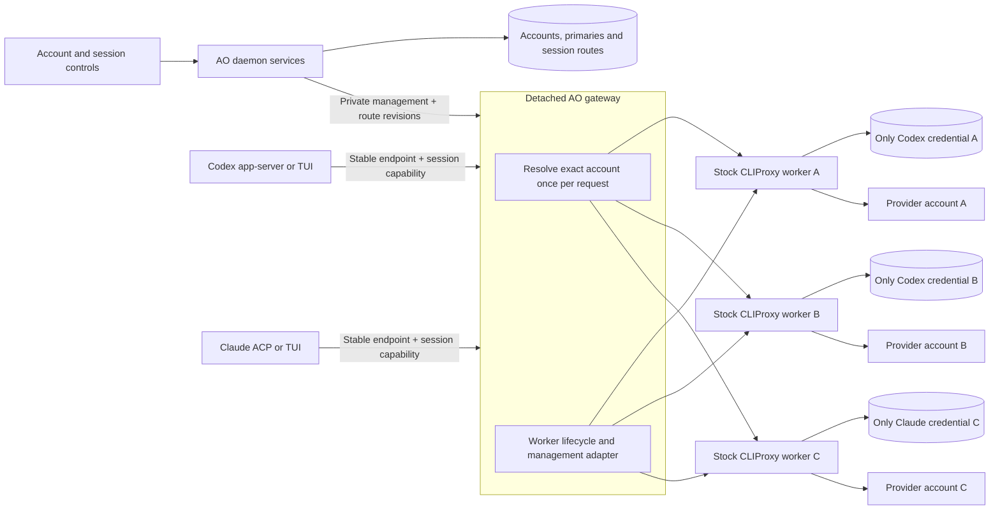
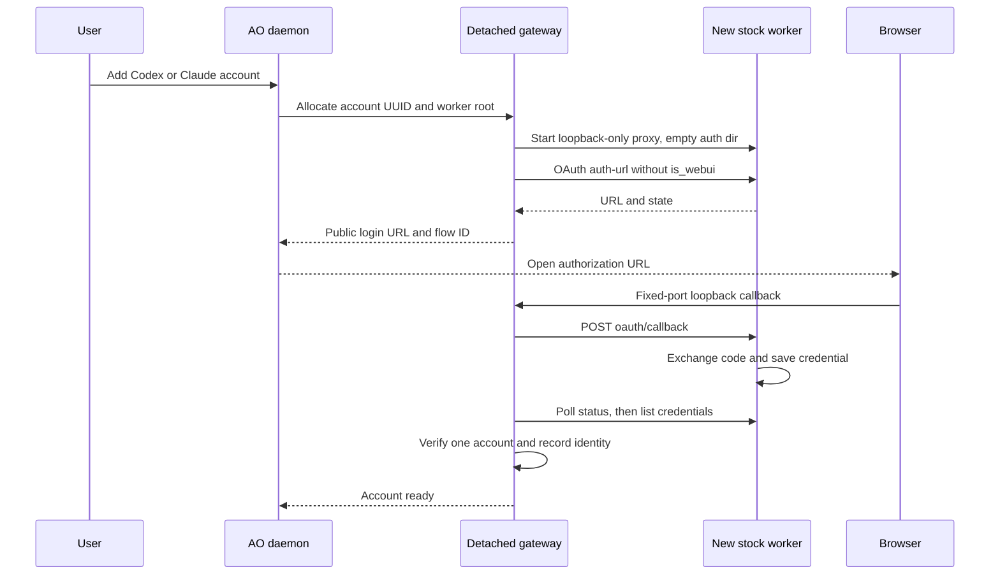

# Approach 2: stock proxy per account behind a detached gateway

**Viable when using the unmodified upstream executable is the main preference.** AO runs a small detached gateway plus a stock CLIProxyAPI process for each active account. Each process owns exactly one credential. The gateway resolves a session capability to the selected process and streams the request through it.

This avoids an SDK selector and an upstream fork. The account guarantee comes from process/credential isolation. It costs more operating machinery than the recommended shared SDK helper, especially with many accounts.

## Architecture



The gateway should be a detached AO helper, not an Electron networking feature or a listener tied to the ordinary daemon. Existing agent processes retain their base URL through daemon restarts. The gateway preserves that address and its acknowledged route snapshot; each worker owns token refresh independently.

One upstream binary can be installed once and launched several times with different config/auth roots. Use pinned verified artifacts or AO-built artifacts, and include notices. Do not use npm as AO's installation channel.

## Request flow and account pinning

1. The native agent sends its normal Responses or Messages request and session capability to the gateway.
2. The gateway validates the capability, snapshots the effective session account/revision, and validates provider/model eligibility.
3. It looks up the worker for that account, starts/reconnects it if needed, and substitutes that worker's private inference key.
4. A streaming reverse proxy forwards the original protocol body and returns the response without buffering the entire SSE stream.
5. All retries for that accepted request remain on the same worker. A missing/unavailable worker or credential returns an error. There is no cross-worker fallback.

The gateway implements cancellation, streaming flush and bounded upstream connection setup. It should preserve upstream protocol error bodies; AO control operations preserve AO error envelopes/request IDs. Native model discovery goes through the selected worker, avoiding merged account/provider catalogs.

The exact-one-credential invariant is essential. A directory shared between workers would load several accounts into every worker. Copies of the same refresh token would create competing refresh/persistence owners. Use a separate authoritative auth directory for each worker.

On login, permit one pending flow for that worker. Verify that the resulting inventory contains exactly one credential total, for the intended provider, and that it is enabled before inference. If a reauthentication signs into a different identity or produces a second filename, block inference and reconcile explicitly. Provision a new worker for a new account instead of silently turning an existing worker into a pool. Prevent arbitrary API-key credentials, aliases and configuration edits from broadening that worker's inventory.

## Account operations



The callback relay is still necessary: upstream's WebUI forwarder binds all interfaces. The gateway owns loopback port 1455 or 54545 for the duration of login and closes it afterward. Fixed ports also mean concurrent workers cannot independently start login receivers. Serialize by provider and handle a native CLI already owning the port.

Aggregate sanitized account inventory from the workers. Primary and session selection remain AO facts; no upstream priority manipulation is needed. Sign-out invokes local credential deletion and leaves an AO row for relogin. Delete also stops the relevant worker and removes its managed account state after resolving session references. User-initiated removal/sign-out moves affected sessions to the matching primary with a message; require a replacement before removing the primary if other usable accounts remain. With no accounts, retain login-required session routes and restore them to the next successfully added primary. Show busy affected sessions and require waiting until they are idle before completing the operation. See the common [semantics](README.md#product-semantics-shared-by-both-approaches).

The management API returns OAuth success without an account ID. A serialized worker flow makes correlation easier because only one account is expected. Never expose worker management keys or raw credential-download operations through the AO frontend API.

## Live account change

The user chooses B; AO persists a pending route change. At the next idle boundary, the gateway verifies worker B, persists/acknowledges the new revision, and subsequent requests with the same session capability go to B. The agent environment and base URL do not change. An accepted stream/retry stays with A.

Use HTTP/SSE initially. A WebSocket reverse proxy generally selects its worker at connection upgrade; changing a lookup table cannot move an established tunnel. Switching requires closing/reconnecting at a safe turn boundary and validating full-context replay. Account-scoped continuation remains a live compatibility test for HTTP/SSE too.

## Lifecycle and data

Example layout, under AO's resolved state directory:

```text
proxy/
  gateway/                  # run identity, acknowledged routes, logs
  workers/<ao-account-id>/
    config.yaml
    auth/                   # exactly one authoritative credential
    logs/
    runtime.json
```

Precreate private credential roots; keep cwd, caches, `WRITABLE_PATH` and logs under the same AO root. Every worker binds inference/management to loopback. Disable discovery, Home, plugins, pprof and control-panel downloads. Child sessions receive only gateway capabilities.

Validate process identity before stop/adoption, reserve/recover worker ports safely, and reuse live workers during daemon replacement. The gateway owns inference lifetime. It retains workers while sessions need them and can stop idle workers only when no requests are running and refresh ownership remains clear. A stopped worker must restore an eligible credential before accepting another request. Never treat an uncertain probe as proof a worker is dead.

Lazy startup can reduce idle processes, but adds first-request latency and complicates recovery. No memory/CPU/binary-size claims have been measured for this research. The observable architectural difference is one SDK helper versus a gateway plus potentially one stock process per account.

## Expected change size

| Authored production area | Estimated LOC |
| --- | --- |
| Shared account/default/session facts, API, launch/readiness and UI | 1,250–1,750 |
| Streaming gateway, exact routing and acknowledged snapshots | 350–500 |
| Per-account process ownership, adoption, inventory and ports | 550–850 |
| Management/OAuth relay and artifact packaging | 450–600 |
| **Total** | **2,600–3,700** |

Tests/generated files/upstream executable code are excluded. This approach can land near 3,000 production LOC, but has less margin than the shared SDK helper. Process recovery and cross-platform packaging are genuine integration work.

## When to choose it

Choose this if upstream executable isolation and simpler account enforcement outweigh runtime/process cost. It is also a fallback if the SDK selector/configuration contract becomes unreliable in a future upstream version.

Acceptance includes the shared tests plus exact-one-credential validation, second-identity relogin, worker crash/restart, busy ports, concurrent account streams, cancellation without leaked requests, and gateway survival during daemon replacement. Verify desktop packaging/signing on the native release platforms. Source inspection supports the architecture; real provider authentication and native-agent traffic still require a live spike.
