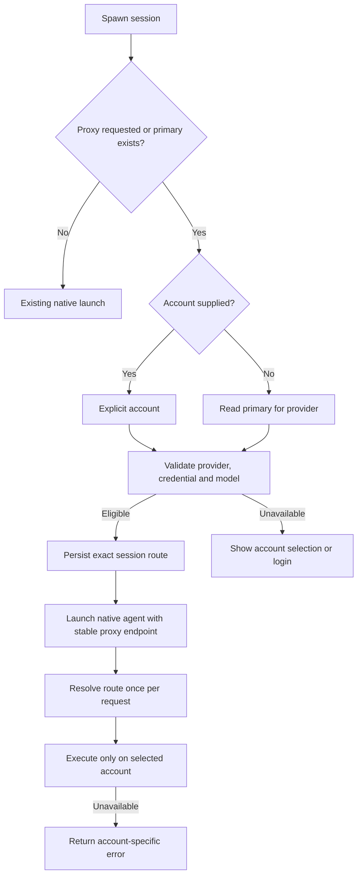

# CLIProxyAPI integration with AO

Final architecture/failure-case review: [findings, fixes and validation](final-review.md).

Research snapshot: 1 October 2026. The alternatives below preserve the initial research. Approach 1 is implemented on `codex/cliproxy-account-manager` and has completed the final architecture review; see the [implementation progress](implementation-progress.md), [live Codex verification](codex-e2e-verification.md) and [final review handoff](review-handoff.md) for evidence and remaining verification limits.

Current planning: [confirmed decisions and one-at-a-time question queue](decisions-and-questions.md). Product recommendations in this research remain proposals unless recorded there as user-confirmed.

All eleven product questions are now answered. See the [implementation plan](implementation-plan.md) for the agreed behavior, build sequence and remaining compatibility gates.

AO was fetched and fast-forwarded to upstream `main` at `d46cc4d190a248094f44fcfefa7b84eb05109fd9`. CLIProxyAPI was cloned separately to `/tmp/ao-cliproxyapi-reference-20261001`, at `fd48ea6840f5572deb53aeb5657740937ac9daaa`. The requested providers are **Codex and Claude**.

Before implementation, AO was refreshed again to `main` at `ec1c6122a`.

Confirmed release scope: sessions running on the user's computer only. Remote AO Cloud sessions are excluded.

The account manager will be a separate panel in Settings. Users sign in again to add accounts; this release does not import existing saved credentials. Keep the existing Subscription panel until the new manager is stable, then retire it in a later change.

Older sessions keep their existing native connection. Account switching, removal-driven reassignment and login recovery cover sessions created through the new manager only; this release does not convert older sessions.

Codex and Claude each have their own primary. The first successfully added account for each provider becomes primary automatically; adding more accounts does not change it.

## Recommendation and alternatives

**Use one detached AO proxy helper importing CLIProxyAPI's public Go SDK.** AO needs a small account-management adapter, durable default/session routing facts, native-agent launch configuration, account pickers, and a strict routing selector. OAuth exchange, credential refresh, provider requests, protocol conversion, streaming and retry machinery stay in CLIProxyAPI.

| Approach | How an account is enforced | Main advantage | Main cost | Estimated added production LOC |
| --- | --- | --- | --- | --- |
| [1. Detached SDK helper — recommended](01-detached-sdk-helper.md) | A small SDK selector chooses exactly the account resolved for the request | One proxy process for all accounts; preserves upstream protocol handlers | Separate helper build; frozen routing configuration is an integration contract | 2,500–3,300 |
| [2. Stock proxy per account + detached gateway](02-isolated-stock-sidecars.md) | Every proxy process contains exactly one account; gateway chooses the process | Uses upstream executable without SDK customization | Gateway plus up to one proxy process per account; more lifecycle bookkeeping | 2,600–3,700 |

These are planning estimates, not measured change counts. They include authored backend/helper/frontend/packaging code, but exclude tests, generated API/sqlc code, documentation and upstream dependencies. Around **3,000 effective production LOC is a credible target for approach 1**, provided the first release uses HTTP/SSE and the existing UI/process primitives. Treat 3,000 as a budget to track during implementation, not an established upper bound. WebSocket switching, automatic account pools, quota dashboards and native-credential import add scope.

The approach-1 forecast was updated after the product decisions. The user requires production:test **1:4**, interpreted as at least four effective authored test lines per production line. At the 3,000 production target, budget at least 12,000 test LOC, counted separately. Generated code, upstream dependency code, comments, blank lines and fixture/snapshot data do not satisfy this ratio.

Both approaches retain AO's native Codex and Claude processes. Codex still supplies app-server/TUI behavior; Claude still supplies ACP/TUI behavior. Their tools, approvals, conversation history and workspaces continue through the existing AO boundaries. The proxy changes how their model requests reach the selected account.

## What upstream actually supplies

CLIProxyAPI supports Codex and Claude OAuth accounts, credential listing, enable/disable, local deletion, refresh, model routing and HTTP/SSE execution. The current public module is **`github.com/router-for-me/CLIProxyAPI/v8`**. Some SDK prose still shows `/v6` and internal-package imports; the checked source exposes public `sdk/config`, `sdk/api` and `sdk/cliproxy` wrappers. See the [evidence ledger](evidence.md).

It does not provide an AO session database or a future-session primary account. Its built-in session affinity can fail over when an account becomes unavailable. The stock HTTP API also lacks a documented arbitrary account-ID request header. AO must implement the user's strict session-account contract rather than equating it with affinity or account priority.

## Product semantics shared by both approaches

1. **Primary per provider (confirmed).** Save one primary Codex account and one primary Claude account. When a primary exists, new compatible sessions route through it by default. Before users set up managed accounts, preserve existing normal-login behavior (confirmed). A new proxy session resolves an explicit account first, otherwise the matching provider's primary. The new session snapshots that account. Changing the primary affects only later sessions: it never reassigns existing sessions or prompts to migrate them. Individual session changes are manual.
2. **Exact session selection.** Choosing an account pins the session to it. Exhausted quota, unexpected missing/disabled credentials, missing models or auth errors produce a visible error; they do not silently use another account. Explicit user-initiated sign-out/removal follows the confirmed reassignment rule below.
3. **Change account on an existing session (idle requirement confirmed).** Complete account changes/sign-out/removal only when affected sessions are idle. If they are busy, show which sessions are using the account and ask the user to wait; do not interrupt work. Retain credentials until the operation completes. A background pending-action queue is not required. A gap between HTTP requests is insufficient: the agent may be running a tool inside the same turn. Recheck idle state and prevent new turns from racing with route changes/removal.
4. **Provider match.** Codex sessions select Codex accounts; Claude sessions select Claude accounts. Cross-provider inference behind the same harness is a separate product capability.
5. **Remove/sign out (confirmed).** Move affected managed sessions to the matching provider's primary and show a message as part of removal/sign-out. Before removing the primary, require a replacement primary if other usable accounts remain. Removing the last account leaves managed sessions present but unable to make requests, with clear login-required information. The next successful login becomes primary and restores their routes. This does not automatically retry interrupted work. Wait for affected sessions to be idle before completing the operation. Older native sessions remain unchanged and are not converted.
6. **Sign out versus remove (confirmed).** Sign out deletes local credentials but keeps the account listed as Signed out for later login. Remove also deletes its list entry after resolving session references. CLIProxyAPI has local credential deletion and disable operations; no provider-grant revocation endpoint was verified. Label local sign-out accurately. Disable retains tokens and is not a substitute for Sign out. Signed-out entries cannot serve requests or be selected as eligible primaries.
7. **Before account-manager setup (confirmed).** Preserve existing normal Codex/Claude login behavior until users add/select managed accounts. After users deliberately remove all managed accounts, managed sessions show login required; they do not silently fall back to the native login. Persist this distinction so an AO restart does not restore unintended access through native credentials.

## AO integration points

AO already ships native Codex account login/list/logout/delete and device-global switching. That existing switch deliberately leaves running controllers alone. Its account UI and action patterns are useful, but device-global identity and proxy primary/session selection have different meanings. Claude has gateway-aware authentication and launch support, but no equivalent multi-account catalog was found. [Current behavior](https://github.com/Untrivial-ai/agent-orchestrator/blob/d46cc4d190a248094f44fcfefa7b84eb05109fd9/docs/STATUS.md#L134-L143).

Add daemon-owned `provider_accounts`, `provider_account_defaults` and `session_provider_routes` facts, or equivalent narrowly scoped records. Store an AO account UUID separately from upstream credential IDs/names, which can change during relogin or a Codex plan change. A session route includes provider, account ID, route revision and any pending change. Use a separate routing table because launch/interface-transition code reconstructs session metadata. Use a new migration, sqlc queries and DB-trigger CDC.

Expose narrow account list/login/cancel/sign-out/delete/primary and session-route operations through AO services/controllers. The frontend and CLI stay thin. Regenerate the code-first OpenAPI and TypeScript contracts. The helper's credentials and management secret never appear in public account DTOs.

Apply default resolution centrally to direct session spawn, project delegation, orchestrator-created workers and automated spawn. Desktop project creation uses `/orchestrators/delegate`, while standalone creation uses `/sessions`. Extend both DTO paths plus `ports.SpawnConfig` and the CLI's mirrored request/flag. Frontend-only default selection would miss several creation paths.

Inject session endpoint/auth through `runtimeEnv`, worker launch and Chat launch preparation. Codex TUI can use `ProviderArgs` config overrides; Codex Chat also needs those overrides on its currently fixed `codex app-server` argv. Claude already receives provider environment variables. Preserve routes through restore, interface handoff and compatible harness transitions. Make preflight/model discovery route-aware: a valid proxy account must not be rejected because the device-global Codex login is absent. Detailed seams are linked in [evidence.md](evidence.md).

For Codex, configure an AO custom provider with a local `base_url`, `env_key`, `wire_api="responses"`, `requires_openai_auth=false` and initially `supports_websockets=false`. Apply this at launch/user-config scope; the current reference says provider configuration is ignored in project-local `.codex/config.toml`. [Official Codex configuration reference](https://learn.chatgpt.com/docs/config-file/config-reference).

For Claude, supply the gateway through `ANTHROPIC_BASE_URL` and a session-scoped gateway token through `ANTHROPIC_AUTH_TOKEN`. AO's Claude adapter already recognizes gateway configuration. Check precedence against ambient OAuth/API credentials and user settings on the supported CLI/ACP versions. [Official Claude gateway configuration](https://code.claude.com/docs/en/llm-gateway).

Session-owned background model calls, including related reviews using the same provider, inherit the session route (confirmed). Work using another provider needs its own compatible account; a separate new AO session follows the new-session default unless explicitly assigned. Hosted AO Cloud/VM sessions are excluded from this release.

## Shared lifecycle and OAuth requirements

Use a stable loopback endpoint in a **detached host**. AO's Chat hosts preserve native processes and their original environment through desktop/daemon replacement. An inference proxy attached to the normal daemon's lifetime would break that behavior. Keep acknowledged routing snapshots in the detached host so active sessions can continue while the daemon is unavailable. SQLite remains authoritative for user policy; reconcile snapshots by revision after reconnect. Report a switch as effective only after the host acknowledges its revision. Fail closed when a new host cannot reconstruct an authoritative route.

All proxy config/auth/cache/log/run files belong beneath the resolved AO data directory. Bind every inference/control/callback listener to loopback. Generate separate inference/session and management capabilities, redact them, and keep management unavailable to agent processes. Disable discovery, Home mode, plugins, pprof, panel downloads and unneeded request-body logging. Follow AO's existing loopback/LAN control separation.

**OAuth requires a small AO callback relay.** Upstream's management `is_webui=true` forwarder and direct SDK authenticators bind callback servers on all interfaces. Use management login without `is_webui`; receive the provider's fixed callback on AO-owned loopback port **1455 for Codex** or **54545 for Claude**, forward it to `POST /v8/management/oauth/callback`, then close the receiver. Serialize login per provider and handle busy callback ports. Upstream performs exchange and storage. Login status returns success without an account ID, so correlate using a post-auth hook or a serialized before/after inventory refresh. [Verified callback implementation](https://github.com/router-for-me/CLIProxyAPI/blob/fd48ea6840f5572deb53aeb5657740937ac9daaa/internal/api/handlers/management/auth_files_oauth_callback.go#L17-L56).

## Implementation decision and acceptance gates

Implement approach 1 after proving the selector survives startup, unchanged config reload and credential refresh. The narrower probes accompanying this research validate the public SDK and request routing; they do not establish live provider compatibility.

Before shipping, validate:

- Two simultaneous sessions remain on their exact accounts; quota/auth/model failures never fall back.
- Primary snapshot, spawn override, idle-only switching and account removal behave as specified.
- Codex Chat/TUI and Claude ACP/TUI retain routing through restore and interface handoff; auxiliary model requests inherit the intended route.
- An active stream and later requests survive daemon replacement; the stable endpoint and route revision are preserved.
- OAuth is loopback-only; secrets stay out of UI/API/logs; callback collisions are surfaced.
- Live Codex/Claude login, refresh, tools, compaction/continuation and account switching work with supported CLI versions. HTTP/SSE avoids connection pinning, but remote continuation state can still be account-scoped; validate full-context reconstruction before claiming seamless switching.
- Deleting an unused account does not disturb another account's requests. Upstream removal can close all execution sessions in a provider executor, so this needs explicit testing even with HTTP/SSE.

Run focused behavior tests first, then AO's relevant complete CI suites, pinned Go/linter/runtime commands, generated-contract drift checks and frontend validation. Verify native helper packaging on macOS/Windows/Linux as applicable. Do not publish as validation.

## Alternatives screened out

An SDK embed inside the ordinary daemon saves packaging work but interrupts inference during daemon replacement. A stock shared proxy with ordinary sticky affinity fails the strict pin contract. A scheduler plugin can fall back to default routing when missing/failing. Unique account model prefixes with a stock shared proxy are conditionally workable, but add request rewriting and model-namespace collision invariants. The two documented approaches express the account guarantee more directly.
