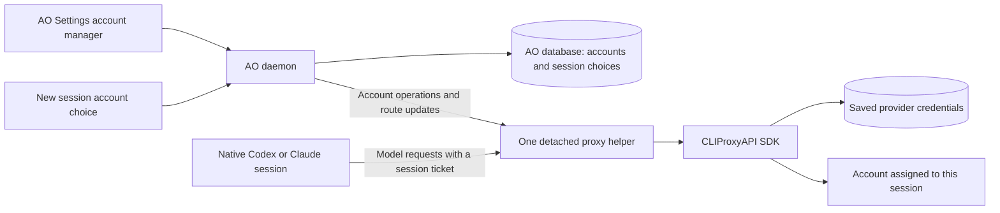
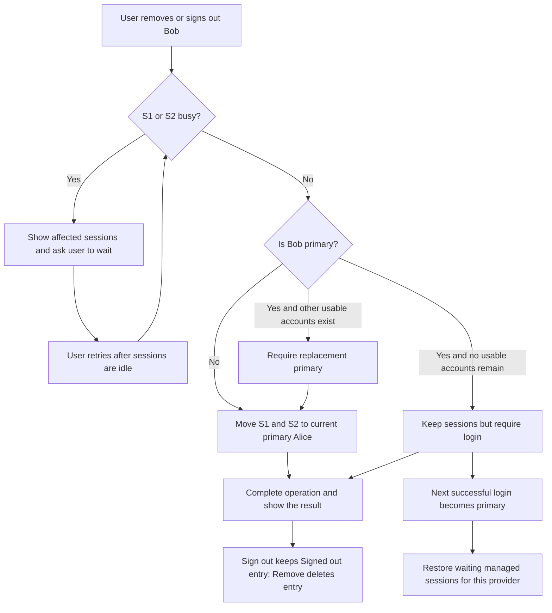

# CLIProxyAPI implementation plan

Prepared 2 October 2026 from the [eleven answered product questions](decisions-and-questions.md), the inspected source and the [routing probes](evidence.md#checks-actually-performed). Implementation is underway on `codex/cliproxy-account-manager`; see [implementation progress](implementation-progress.md) for the current wiring, validation, and remaining gaps. This document preserves the agreed plan rather than certifying completion.

## What we are building

Add a separate **Account manager** panel in AO Settings for Codex and Claude. Users sign in again through this panel. Each provider has its own primary account; its first successful login becomes primary. Adding another account does not change the primary.

New sessions use the matching primary unless the user chooses another account. Older sessions keep their existing native login and are outside account switching in this release. Changing the primary alone never moves existing sessions. Related AI work using the same provider uses the managed session's account.

Sign out keeps a Signed out entry; Remove deletes the entry. Either operation moves the affected managed sessions to the matching primary and explains the move to the user. If removing the primary, require a replacement first when another usable account remains. If removing the last usable account, show that login is required, keep the sessions, and deny further model requests. The next successful login becomes primary and restores those managed sessions' routes, without automatically resending interrupted work.

If affected sessions are busy, show them and ask the user to wait until they are idle. Do not interrupt them, delete their credentials early, or build a background removal queue. Recheck idle state when the operation is submitted.

This release covers the user's computer only. Keep the existing Subscription panel; retire it separately once the manager is stable. Account import, conversion of older sessions, remote AO Cloud routing, automatic quota-based rotation, and additional usage dashboards are excluded.

## How CLIProxyAPI enters AO

Create a small, separately built Go helper, provisionally `ao-proxy-host`, in its own module. Import the pinned public `github.com/router-for-me/CLIProxyAPI/v8` SDK there. Build and package the helper alongside AO's daemon. No user installation of CLIProxyAPI is needed.

The SDK runs inside that helper: one process for all accounts. AO's daemon calls its private account and routing operations. Native Codex and Claude send model requests to its stable local address. CLIProxyAPI handles login exchange, credential storage/refresh, provider requests and streaming. AO supplies the account preferences, session mapping, account panel and native launch settings.

The ticket identifies the session; it is not the user's provider password or login token. The helper looks up the session's current account for each request. Updating that mapping lets later requests use another account while the agent keeps the same local address and ticket. This establishes how routing changes; live tests must establish whether both clients preserve their conversations without restarting.

## Where state lives

All new state goes under AO's resolved data directory, normally `~/.ao`, with `AO_DATA_DIR` respected.

| Owner | Facts or files |
| --- | --- |
| AO SQLite | Stable account IDs, provider, safe display identity, upstream credential reference, each provider's primary, and whether managed routing has been set up. |
| AO SQLite | Each managed session's assigned account, route revision and any interrupted update intent. Keep these separate from reconstructed session metadata. |
| Helper | CLIProxyAPI configuration, provider credential files, private run/control information and an acknowledged routing snapshot; proposed subdirectory `proxy/`. |
| Native agent | Existing conversation and workspace storage through AO's current mechanisms. Do not put transcripts into CLIProxyAPI's credential store. |

Keep account IDs stable across re-login even if upstream filenames change. Signed-out entries retain identity but no saved provider credentials. Removing an entry must not leave broken database references: reassign its routes first, or represent them as explicitly awaiting login when no account remains.

Persist the difference between **not yet set up** and **deliberately signed out of all managed accounts**. Before setup, existing normal login still works. After setup, removing all managed credentials must not silently restore device-global login for managed sessions or default new sessions. Handle this independently for Codex and Claude. Older native sessions remain unchanged.

## Build sequence

### 1. Prove native compatibility before building the full UI

Extend the temporary SDK probe into a real service-startup check: selector installation, unchanged configuration reload, credential refresh, concurrent requests and exact routing across retries. Keep the default SDK manager and freeze routing settings that could replace AO's selector. Reject arbitrary client account headers; only the validated session mapping chooses the account.

Then exercise Codex Chat/TUI and Claude Chat/TUI against the helper with real test accounts. Check ordinary prompts, tools, model discovery, compaction and an idle account switch in the same conversation. Test a no-account period followed by login. Start with HTTP/SSE; disable Responses WebSockets to avoid a connection retaining an old account pin.

Two gates can change the implementation: account-scoped conversation continuation, and upstream credential removal closing provider-wide execution sessions. Prove that switching/recovery preserves conversation and removing an idle account does not interrupt another account's active work. If either fails, revise the design before promising restart-free behavior or finishing the account UI.

### 2. Add helper lifecycle and private account operations

Reuse AO's detached-process conventions so the helper survives ordinary daemon/desktop replacement. Keep a stable endpoint, process identity, route snapshot and reconnect handshake. Do not kill/restart an apparently unresponsive helper based solely on an unknown probe. Account operations require an available AO daemon; acknowledged routes can continue while it reconnects.

Wrap the upstream credential and OAuth management endpoints behind a narrow private adapter. Use AO-owned loopback callback receivers on the provider-required ports, forwarding callbacks to upstream management. Do not use upstream's all-interface callback forwarders. Serialize provider login, surface callback-port conflicts, support cancellation, and mark login complete only after success plus verified credential inventory.

Keep session and management credentials separate. Bind inference, control and callbacks to loopback; protect the helper's private control operations. Redact provider credentials and tickets from normal API responses/logs. Disable unused upstream configuration writes, panel downloads, plugins and discovery. Pin the SDK revision and retain its license notice.

### 3. Add durable account and routing facts to AO

Add narrowly scoped domain/port/service/store records for accounts, provider defaults/adoption, and session routes. Use a new SQLite migration, sqlc queries and DB-trigger change events. Do not modify merged migrations or hand-edit generated files.

Resolve routing centrally: an explicit compatible account wins; otherwise use the provider primary after managed setup. Without eligible credentials in managed mode, return a login-required error. Quota/auth/model failures on an assigned account never trigger automatic fallback.

For switches/removal, validate eligibility and affected sessions, guard against new work starting during the operation, save an update intent, apply a revisioned batch to the helper, and commit the effective database facts after acknowledgement. Reconcile crashes between these steps. This recovery intent is distinct from scheduling a user's busy-session removal for later.

Reassign affected routes before deleting credentials. If credentials cannot be deleted, keep the removal incomplete and show a recoverable error; do not report successful sign-out. If the last account is removed, clear the matching primary and retain login-required routes. On the next successful login, assign only those waiting managed sessions for that provider to the new primary.

### 4. Connect every relevant native launch path

Extend `ports.SpawnConfig` and the relevant request DTOs with an optional account selection. Apply defaults in the daemon for desktop delegation, standalone sessions, CLI, automation and orchestrator-created sessions. A separate newly spawned session uses its own explicit selection or the current matching primary.

Wire the stable helper address/ticket through `backend/internal/session_manager/manager.go` launch preparation. Pass the same Codex custom-provider configuration to both TUI and `codex app-server`; set Claude's process-specific gateway configuration for ACP and TUI. Make readiness and model discovery use the selected route rather than requiring the device-global Codex login. Verify credential precedence so ambient native credentials cannot bypass the assignment.

Keep routes across restore and Chat/TUI handoff for managed sessions. Related model calls and native child work owned by the same session inherit its account when the provider matches. Do not convert older native sessions.

### 5. Add the thin API and UI

Expose account list, login/status/cancel, sign-out, remove, set-primary and session-account read/change through AO controllers and services. Proposed resource families are `/api/v1/provider-accounts` and a session account route; finalize names against nearby controller patterns. Return only safe account identity, availability, primary indicators and affected-session information. Use the existing API error envelope for busy, login-required and incompatible-account errors.

Add the separate Settings panel using the existing settings catalogue/components. Group Codex and Claude, show Primary and Signed out labels, and reuse login/action patterns. Add account selection to new-session creation and a current-account/switch control for managed sessions. If sessions are busy, show their names and ask the user to wait. Show the destination before removal; require a replacement when removing the primary. Clearly explain last-account sign-out and link to login.

Keep account logic out of Electron/React. Extend thin CLI calls where needed without opening storage directly. Regenerate the OpenAPI and frontend types together; use change events/query invalidation to update views.

### 6. Package and verify

Build the separate helper module for AO's supported release platforms, include it in dev/release daemon packaging, and test launching it from packaged resources. Follow existing signing, artifact verification and release rules; no publishing as validation. Helper upgrades must respect active sessions and protocol compatibility, rather than replacing the executable beneath a live host without a recovery strategy.

Run focused boundary tests first, then the repository's complete applicable workflow checks: backend build/test/race/vet/lint, frontend typecheck/tests/build, generated SQL/API drift and desktop/CLI checks. Add separate helper-module tests and compatibility checks to CI. Verify platform-specific jobs in CI if their native environment cannot run locally.

## Example: remove an account

Alice is the primary Codex account. Bob serves sessions S1 and S2. Removing Bob does not change a session already using Alice or an older native session.

At the final operation boundary, recheck the primary, account eligibility and idle state. Every request already accepted by the helper keeps its original account through retries; future accepted requests use the acknowledged new route.

## Acceptance and size

The integration is ready when two accounts can serve separate simultaneous sessions; primary changes affect only new sessions; manual switching and removal obey idle rules; related work follows the session; last-account sign-out/re-login recovers managed routes; and older native sessions remain unchanged. Quota/auth/model failures must never silently rotate accounts. Verify persistence through AO replacement, OAuth refresh, credential deletion and native conversation continuation.

Target roughly **3,000 effective authored production LOC**, with a revised planning range of **2,500–3,300** for the finalized scope. The [area breakdown](01-detached-sdk-helper.md#expected-change-size) includes the helper, backend, frontend and packaging changes. Exclude tests, generated artifacts and upstream dependency code from production LOC and report those separately. Reuse existing settings, lifecycle and API machinery. This replaces the earlier 2,200–3,100 forecast; refine it after the compatibility gates rather than treating it as a cap or a guaranteed delivery time.

The user requires production:test **1:4**, interpreted as **test LOC >= 4 × production LOC**. For 3,000 production LOC, add at least 12,000 effective authored test LOC; the forecast range implies 10,000–13,200 at minimum. Measure feature-added effective lines in both categories, excluding comments, blank lines, generated artifacts, dependency code and snapshot/fixture data. Include authored production SQL/build scripts and supporting test code in their appropriate categories. Publish both counts and the measured ratio with the implementation.

Tests must exercise observable behavior and boundaries: simultaneous exact-account requests, retries, idle/start races, primary/removal/sign-out rules, login recovery, callback failures, interrupted route updates, native launch precedence, daemon replacement and UI/API errors. The line-ratio requirement is additional to these acceptance checks.

At the time this plan was prepared, production implementation and real-account tests had not run. The initial compile/fake-routing results remain in the evidence ledger; [implementation progress](implementation-progress.md) records current verification and remaining gaps. Initial document validation passed for all seven Mermaid diagrams, fourteen local links, balanced code fences and `git diff --check`.
