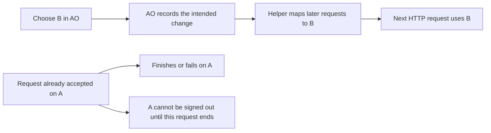

# Codex request-boundary account switching

Codex request-boundary switching is now part of the normal account service. There is no startup flag. When a user changes a default, AO records whether the change is for new sessions only or should also move existing Codex routes for their next request; Claude keeps its idle-only behavior.

When the user chooses “move existing sessions,” changing Codex default A to B reassigns every managed Codex route currently on A, including explicit A selections. The “new sessions only” choice changes only the default. Routes on other accounts remain unchanged. An individual switch only changes its selected session. Already admitted requests and their internal SDK retries keep the account captured at admission; later HTTP requests, including client-generated retries, use the current route. No agent restart, approval cancellation, command replay, or removal of encrypted context is part of this change.

The helper must retain in-flight counts by account as well as session: after A→B, an unfinished A request must still prevent A's removal. Routing snapshots include the signed-in auth inventory so credential retirement is refused before AO commits removal. Recovery must retain the original request-boundary admission decision in the durable mutation journal. Helper protocol compatibility must fail closed.

## Regression suite, defined before live testing

| Case | Evidence required | Status |
|---|---|---|
| Busy primary A→B | Busy and idle A routes move; C and Claude routes stay; tickets unchanged | Passed — sequential automated regressions |
| Busy individual switch | Only selected Codex route moves; Claude still requires idle | Passed — sequential automated regressions |
| Outstanding request | Held HTTP and SSE responses finish on A, subsequent requests select B | Passed — sequential automated regressions |
| Account retirement | Removing A after its routes move remains blocked by unfinished A requests | Passed — sequential automated regressions |
| Request/switch race | Each admitted request uses one complete old/new mapping; no mixed credentials | Passed — sequential automated regressions |
| Rapid A→B→C | Latest acknowledged mapping wins; outstanding leases retain their original account | Passed — sequential automated regressions |
| Persistence failure | Failed save publishes nothing; lost acknowledgement/commit/finish recover exact intent | Passed — sequential automated regressions |
| Default-change choice | New-sessions-only leaves old routes in place; move-existing rebinds previous-default Codex routes | Passed — sequential automated regressions |
| UI explanation | Codex always says next request; Claude retains idle/default wording | Passed — sequential automated regressions |
| Live response/tool workflow | Same conversation, actual A/B upstream identity, GPT-5.5 Low | Passed — A→B during a real tool turn |
| Live approval wait | Approval preserved; denied harmless tool never executes; next request uses new account | Passed — B→A preserved the same approval; denial cancelled the turn; follow-up used A |
| Live compacted context | Switch after real compaction; context/tool continuation intact | Passed — compaction on A, continuation on B |
| Live unavailable target/retries | No silent alternate account; original stream not replaced or replayed | Previous missing-target live evidence reused; new failure-after-rebind regression passed. Real quota/outage not induced |

Live checks use the existing Electron app/data, two existing Chrome Codex accounts and disposable sessions only. No Claude inference, publication, deployment, or heavyweight parallel testing. Preserve and restore the catalogue, primary and session assignments. Automated fake-provider routing evidence does not certify real encrypted/compacted-state portability.

## Automated results — 4 October 2026

- Backend `go test -race -p 1 ./internal/service/provideraccounts ./internal/adapters/proxyhost ./internal/httpd/...`: passed, including real SQLite save/commit/finish failures and reopening with the experiment disabled while replaying a durably admitted rebind.
- Helper `GOWORK=off go test -race -p 1 ./...`: passed, including real local HTTP/SSE concurrency, cancellation, per-account retirement protection, migration from pre-inventory routing snapshots and failed durable writes. Same-revision bootstrap may add the initial inventory only with unchanged routes; later mismatched replays fail.
- Five complete frontend component/journey files: 131 tests passed with one worker. Frontend TypeScript check, backend build/vet and diff checks passed.

The helper control protocol is now version 2. A running version 1 helper is rejected rather than replaced automatically. Live testing stops the verified old helper only after the existing app/daemon have stopped, then restarts with the same private identity and data. The experiment does not make SDK retries switch credentials: retries within an admitted HTTP request retain the captured account. New client HTTP calls use the latest route.

Live preflight found Codex B primary and signed in, A retained but signed out, nine managed routes on B, and no busy sessions. This actual starting state supersedes previous reports that described A as primary. An online database backup and source/binary backup were made before the authorized same-app restart. No credential backup is imported into a login flow.

## Live results — existing Electron, Codex only

The experimental daemon used the same checkout/profile/data as the existing dev app. Chrome's two already-signed-in identities were used to reauthorize the retained A entry; B remained primary until the test chose A. All nine managed routes moved from B to A. Every inference and manual compaction used the disposable `scratch-9` Chat on GPT-5.5 Low; no original conversation received a test prompt, no Claude operation was performed, and no new session was needed.

Temporary instrumentation in the **live test checkout only** recorded selected upstream auth IDs at the existing exact selector, never credentials, tickets or request contents. It was removed with the test build during cleanup. Selection timestamps correlated with the UI operations and real responses:

| Time (local) | Observed selection/action |
|---|---|
| 15:38:20, 15:38:55 | A selected for the bounded tool turn |
| During the running turn | Electron primary A→B moved all nine routes; the Chat stayed working |
| 15:39:30, 15:39:55 | B selected for subsequent API calls; reply recalled `SWITCH_ORCHID_104 TOOL_SWITCH_COMPLETE` |
| 15:41:29 | B selected for the harmless approval request |
| During approval wait | Individual session B→A acknowledged; the approval request identity stayed identical; Deny cancelled `printf AO_SWITCH_DENIED_TOOL` |
| 15:43:20 | A handled the follow-up and recalled `SWITCH_ORCHID_104 APPROVAL_SWITCH_COMPLETE` |
| 15:43:46 | Manual `/compact` on A completed; Electron showed history compacted, 38.1k reclaimed, 2% full |
| 15:45:03 | After switching the compacted session to B, B recalled `SWITCH_ORCHID_104 COMPACT_SWITCH_COMPLETE` |

Codex's existing denial behavior ended the approval turn. An initial wait for an automatic post-denial answer timed out; the UI showed Cancelled and interrupted. The subsequent explicit follow-up succeeded on A without retrying the denied command. This is not an account-switch cancellation: the same approval survived until the explicit Deny action.

The dummy Chat's native conversation ID, controller generation and runtime launch ID stayed identical across the live switches and compaction. All 42 stored session IDs/native conversation identities/termination facts matched the pre-test backup. Account/default/session-assignment facts were restored exactly: B signed in and primary with nine routes, A retained and signed out with zero, Claude unchanged. The original dev sources/binaries and normal launch configuration were restored; experimental/debug flags and temporary selector tracing are absent from the normal app.

The final helper rerun exposed an incorrect test assumption that concurrent HTTP completions must be recorded in admission order. The test already asserted A/B admission and response identity separately; its final inventory assertion now checks one completion per account regardless of completion order. The full helper race suite passed again, followed by 20 focused repetitions. The additional failed-A-after-rebind regression passed: the original A request failed without executing B, while the next client HTTP call used B.

These results support review of request-boundary switching for this installed Codex version and the exercised tool/approval/compaction states. They do not establish every provider-owned encrypted state, native CLI version, actual provider outage or real quota exhaustion. Existing no-fallback SDK regressions and prior live missing-target evidence are reused where unchanged; those cases are not relabelled as new live tests. No release, deployment or PR publication occurred.

Local screenshot: `/tmp/ao-request-switch-compaction.png` (actual Electron conversation; intentionally not committed).

## Code size and review readiness

The local checkpoint is committed; experimental source/tests remain uncommitted for separate review. The experiment has 97 authored added production lines and 801 authored added test lines. Whole-branch effective authored additions versus `ec1c6122a` are 3,029 production / 13,364 tests (4.41:1), a net increase of 66 production lines over the checkpoint. Generated DTOs, dependency records, static translations, comments and blanks are excluded consistently.

Review the per-account leases and retirement inventory together, bootstrap/replay rules, durable admission mode and the user-selected default-change scope. The existing app uses the automatic request-boundary behavior; no environment setting is required.
