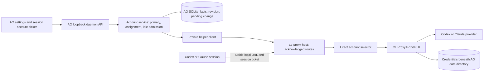

# Final review handoff

The final architecture/failure-case review has been performed; see [findings, fixes and validation](final-review.md). Implementation and local regression verification are recorded below. Use the [progress record](implementation-progress.md) and [live Codex verification](codex-e2e-verification.md) for checks and their limits. This file identifies the architecture and failure cases for the requested final model review; the completed review is linked above.

## Ownership and flow

The frontend is a thin supervisor. AO owns account identity, separate provider primaries, session assignments and idle admission. The separate helper owns the upstream SDK and its credentials. Per-session tickets identify routes; the account selector must never substitute another account. Management keys and upstream credentials remain outside the renderer and agent process environment.

A route change obtains admission from affected workers/reviewers, records a durable pending change, waits for the helper to acknowledge the exact revision and routes, then commits AO facts. Credential deletion happens after reassignment. A busy refusal normally clears the pending intent and requires a fresh action. If that cleanup write also fails, the operation remains unresolved and reports recovery required; see the final review. A lost acknowledgement or failed commit is reconciled before another mutation. Startup and maintenance restore acknowledged routes on the same helper endpoint; unknown live processes are not replaced.

## Start the code review here

| Boundary | Entry points |
|---|---|
| Account rules and durable mutation | `backend/internal/service/provideraccounts/service.go`, `login.go` |
| SQLite facts and journal | `backend/internal/storage/sqlite/store/provider_accounts.go`, migration `0173_provider_accounts.sql` |
| Helper identity, restart and OAuth callbacks | `backend/internal/adapters/proxyhost/client.go`, `login.go` |
| Session and reviewer admission | `backend/internal/session_manager/provider_accounts.go`, `backend/internal/service/chat/provider_account_guard.go`, `backend/internal/review/review.go` |
| Agent launch isolation | `backend/internal/agentlaunch/provider_proxy.go`, Codex app-server driver |
| Ticket validation and request lifetime | `proxy-host/internal/host/routes.go`, `server.go` |
| SDK account selection | `proxy-host/internal/host/selector.go`, `service.go` |
| API and LAN separation | Account controllers, `httpd/lan_listener.go`, `httpd/cors.go` |
| UI and distribution | Account settings/pickers, `frontend/scripts/build-daemon.mjs`, `frontend/src/shared/daemon-launch.ts`, helper-path configuration |

## Required review cases

- Migration 173 must preserve main and earlier unmerged preview databases that consumed versions 171/172, including an existing account table/trigger. The live HTTP 500 and complete SQLite regression suite establish this upgrade path.
- Prepared task promotion must assign the account using the resolved spawn provider, since the prepared record's provider is initially empty. Both provider directions and synchronous/asynchronous starts have regression coverage.

- Changing either provider's primary affects new managed sessions only; existing pins remain unchanged. Provider primaries are independent.
- Signing out retains a signed-out catalogue row; removal deletes it. Removing a primary with alternatives requires an eligible replacement. Last-account removal leaves managed routes unauthorized. The next verified provider login restores waiting routes and becomes primary.
- Busy workers, unknown runtime/activity states, active reviewers, queued input and in-flight inference streams prevent route mutation. Manual switching never stops or restarts the conversation.
- Reviewers using the owner's provider follow the owner's exact route; reviewers using another provider retain their native behavior. Older native sessions remain native.
- Unknown or empty tickets, removed/disabled auth, quota exhaustion, unsupported models, malformed acknowledgements and corrupt route storage fail closed. SDK retries must not select another account.
- Crash/restart at each journal step, duplicate acknowledgement, failed SQL write, failed credential cleanup, stale OAuth callback, callback port conflict and lost login response remain recoverable without exposing credentials or importing native device accounts.
- The helper binds only loopback. Private management endpoints cannot be reached with inference tickets. Account APIs are unavailable through the LAN listener. Spoofed account-selection headers are scrubbed.
- Helper distribution includes the matching executable and upstream license, including Windows development manifests. AO-owned state stays beneath the resolved AO data directory.
- Source-based macOS/Linux development passes the built helper's absolute path explicitly because `go run` executes AO from a temporary directory. Packaged and versioned Windows daemons keep sibling discovery. Relative overrides must be rejected.
- The SDK requires a configured management secret even with a local password. The helper saves only a bcrypt hash of its control key in private SDK configuration and keeps remote management disabled. Real SDK login-start/status/cancel checks for both providers pass through the actual scratch desktop daemon.

## Evidence limits

Automated suites use fake providers, real SDK execution paths, local HTTP/SSE, real SQLite, subprocess fixtures and UI journeys. The additional user-authorized live pass signed in two real Codex accounts and used only GPT-5.5 Low. Terminal and Chat text conversations continued across an idle account switch, recalling earlier input without a restart. The same Chat recovered after last-account sign-out and re-login. **Real Claude, compacted/tool-heavy conversations, quota exhaustion and general portability of encrypted/provider-owned state remain unverified.** Native selector/dialog automation was intermittent; the live record distinguishes UI actions from API operations. Standalone creation was blocked by the pre-existing dev database project-ID constraint; project sessions were used.

Native Windows execution and release signing/notarization require their actual runners. A successful local cross-build does not establish either result. No release or deployment is part of this task.

Latest UI checkpoint (3 October): 48 verified, five partial, 11 blocked/skipped. The same existing Electron app was briefly attached with Playwright; controlled daemon/helper recovery preserved saved state and native runtime/conversation identities. This is partial boundary evidence, not certification of the signed-in UI variants. The normal app launch has been restored with no debugging listener. Codex remains without a signed-in account after last-account removal; Chrome's saved permission still blocks `auth.openai.com`, and native control reports the Mac locked. See [the current case matrix](codex-ui-verification.md) for exact evidence. Do not treat this handoff as completed live UI coverage.

## Latest Codex UI continuation — 4 October 2026

The [current UI matrix](codex-ui-verification.md) supersedes older permission-blocked checkpoints: **62 verified, one partial, one not run live**. Browser access works and both Codex accounts are restored; A is primary and scratch-9 is explicitly pinned to B. Thirteen of the 15 previously remaining cases are newly complete. Stale callback redelivery against a fresh listener remains partially blocked by Chrome (`ERR_BLOCKED_BY_CLIENT`); the old closed relay admitted no account and fresh login succeeded. The live reviewer test was withheld because AO’s reviewer prompt requires publishing a GitHub review, outside the explicit no-publish scope; reviewer protection passed the sequential race suite.

Two additional defects were fixed: Codex terminal idle proof now understands both current `›`/`»` glyphs while preserving style/draft/approval safeguards, and the default new-task choice no longer sends a cached primary as an explicit pin. Live open-form creation reproduced stale A before the fix and selected current A after a B-to-A primary change following the fix. Explicit choices remain explicit. Thirty-four glyph cases and four default-resolution regressions demonstrate before/after behavior; 88 complete frontend component/journey tests and the affected backend race suites passed sequentially. Counts are **2,963 authored production / 12,576 test lines (4.24:1)**. Signed-in daemon/helper recovery, real approval-wait protection, primary removal and controlled missing-account isolation have actual Electron UI evidence. All inference used GPT-5.5 Low; Claude and original conversations were preserved. See the matrix for controlled-fixture distinctions and final cleanup/validation details.

Final cleanup restored both Codex sign-ins with A primary and all nine managed routes on A, including the disposable-session pins. The same app/profile/data runs normally with no port 9337 or test Chromium flags. Original 38 session native identities/termination facts and Claude state are preserved; 42 total records include four test sessions. Final frontend typecheck, backend build/vet and diff checks passed. The two live evidence gaps above remain; no publication/deployment occurred.
